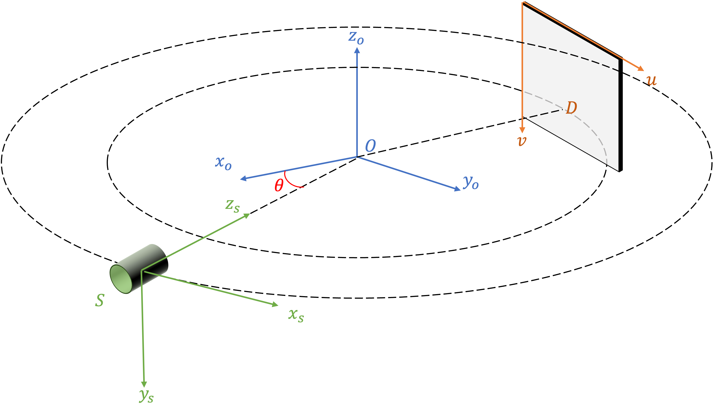

# NAF: Neural Attenuation Fields for Sparse-View CBCT Reconstruction

Code for MICCAI 2022 Oral paper [NAF: Neural Attenuation Fields for Sparse-View CBCT Reconstruction](https://arxiv.org/abs/2209.14540) by [Ruyi Zha](https://ruyi-zha.github.io/), [Yanhao Zhang](https://sites.google.com/view/yanhaozhang/home) and [Hongdong Li](http://users.cecs.anu.edu.au/~hongdong/).

A neural-field-based method for CBCT reconstruction.

[\[paper\]](https://arxiv.org/abs/2209.14540)[\[dataset\]](https://drive.google.com/drive/folders/1BJYR4a4iHpfFFOAdbEe5O_7Itt1nukJd?usp=sharing)


## Setup

We recommend using [Conda](https://docs.conda.io/en/latest/miniconda.html) to set up an environment.

``` sh
# Create environment
conda create -n naf python=3.9
conda activate naf

# Install pytorch (hash encoder requires CUDA v11.3)
pip install torch==1.11.0+cu113 torchvision==0.12.0+cu113 torchaudio==0.11.0 --extra-index-url https://download.pytorch.org/whl/cu113

# Install other packages
pip install -r requirements.txt
```

## Training and evaluation

Download four CT datasets from [here](https://drive.google.com/drive/folders/1BJYR4a4iHpfFFOAdbEe5O_7Itt1nukJd?usp=sharing). Put them into the `./data` folder.

Experiments settings are stored in `./config` folder.

For example, train NAF with `chest_50` dataset:

``` sh
python train.py --config ./config/chest_50.yaml
```

*Note: It may take minutes to compile the hash encoder module for the first time.*

The evaluation outputs will be saved in `./logs/eval/epoch_*` folder.

## Customized dataset

You can make your own simulation dataset with TIGRE toolbox. Please first install [TIGRE](https://github.com/CERN/TIGRE/blob/master/Frontispiece/python_installation.md).

Put your CT data in the format as follows. Examples can be seen in [here](https://drive.google.com/drive/folders/1BJYR4a4iHpfFFOAdbEe5O_7Itt1nukJd?usp=sharing).

```sh
├── raw                                                                                                       
│   ├── XXX (your CT name)
│   │   └── img.mat (CT data)
│   │   └── config.yml (Information about CT data and the geometry setting of CT scanner)
```

Then use TIGRE to generate simulated X-ray projections.

``` sh
python dataGenerator/generateData.py --ctName XXX --outputName XXX_50
```
## Coordinate system
Our coordinate system is similar to that in TIGRE toolbox, except for the detector plane which follows OpenCV standards.




## Citation

Cite as below if you find this repository is helpful to your project.

```sh
@inproceedings{zha2022naf,
  title={NAF: Neural Attenuation Fields for Sparse-View CBCT Reconstruction},
  author={Zha, Ruyi and Zhang, Yanhao and Li, Hongdong},
  booktitle={International Conference on Medical Image Computing and Computer-Assisted Intervention},
  pages={442--452},
  year={2022},
  organization={Springer}
}
```

## Acknowledgement

* Hash encoder and code structure are adapted from [torch-ngp](https://github.com/ashawkey/torch-ngp.git).
* Many thanks to the amazing [TIGRE toolbox](https://github.com/CERN/TIGRE.git).
